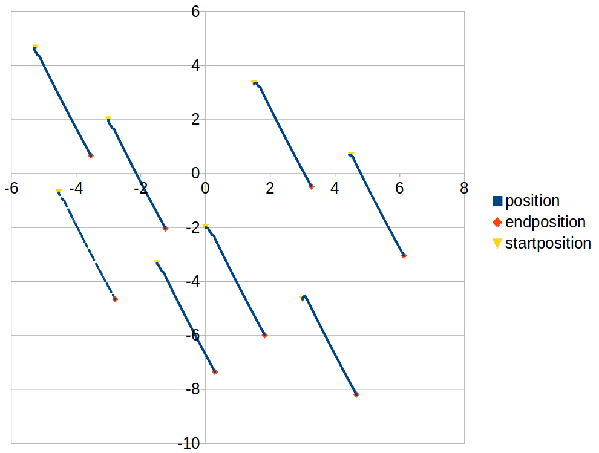

# Assignment 3 

## User Guide 

### Setup
Looking at line 13 in the [synchronized](scripts/assignment3_synchronised.py) or [balanced](scripts/assignment3_balanced.py) file we can see the variable <mark>REAL_MODE</mark>, which can be set to True or False. If this variable is set to False the code works in the Gazebo Simulation environment, if it is set to True it work for the live demo on the turtlebot. 

Important Note: one needs to check whether the bot numbers used in the code are equivalent to the bot numbers in the simulation or real life testing. 

### Bring up
Since the turtlebot have an IMU we do not depend on the vicon, though there are some things to be careful about. When launching the bots in real life it is important that they all face the same direction so that all bot measure the same orientation when facing the same direction

### Run the code
After setting up the bots, all there is left is to choose the desired file and run it. 

### What is the front of the turtle bot ? 
For some reason the bots can either have the wheels on the front or the wheels on the backside. Bot 0 and 2 were having the wheels in the back, whilst 1 and 3 at the front. This is very important for the bring up sequence. 

## Synchronized Mode 
Synchronization assumes that all the heading angles for the unicycles have a common value. Lets consider U 1 (θ) as the kinetic energy of the center of mass of the n unicycles. 

The unique maximum of U m (θ) corresponds to the case when for distinct pairs of unicycles i and j, one has θ i = θ j, this would mean that we reached the synchronized mode. Hence it is natural to propose the gradient control law as control input for the bots.

.png)

For reaching the maximum hence synchronized mode k needs to be < 0

### Graph from Simulation 
the picture shows the path from 8 bots, starting at random positions:

#### Initial Orientation:

Bot 1: θ  = 0

Bot 2: θ = -1.57

Bot 3: θ = 1.57

Bot 4: θ = -2.36

Bot 5: θ = 0.79

Bot 6: θ = -0.78

Bot 7: θ = 2.36

Bot 8: θ = -2.75

 

## Balanced Mode 
Balanced behavior assumes that the center of mass of the evolution of the unicycles remain constant. This is achieved by minimizing U m (θ) and hence using gradient descent as our control law.

.png)

For reaching the minimum and by that balanced configuration, k need to be > 0 

### Graph from Simulation 
The picture shows the path from 4 bots running in balanced mode with a steady turning rate of w0 =  2.0 and forward pace of v0 = 0.1.

The red marked point are the positions of the bots when after balancing themselves out for a while. 

## Link to Demo Video 
Here is a Video of the live demo: 
